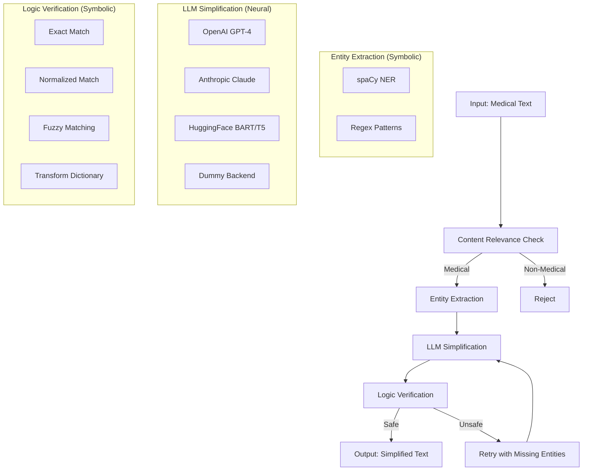

# SafeSim: Safe Medical Text Simplification with Neuro-Symbolic Verification

<p align="center">
  
</p>

<p align="center">
  
  
  
</p>

SafeSim is a medical text simplification system that uses a **neuro-symbolic approach** to convert complex discharge summaries and clinical notes into patient-friendly language while **guaranteeing** the preservation of critical medical facts.

## Architecture



## Quick Start

### Installation

```bash
pip install -r requirements.txt
python -m spacy download en_core_web_sm
```

### Run the Web Interface

```bash
streamlit run src/ui/app.py
```

### Run the API Server

```bash
uvicorn src.api.app:app --host 0.0.0.0 --port 8000
```

### Use as a Library

```python
from src.safesim_pipeline import SafeSimPipeline

pipeline = SafeSimPipeline(llm_backend="dummy", strictness="high")
result = pipeline.process("Patient prescribed 50mg Atenolol PO q.d. for hypertension.")

print(f"Simplified: {result.simplified_text}")
print(f"Safe: {result.is_safe}")
```

## Features

- **Multi-Entity Extraction**: Dosages, medications, vitals, frequencies, routes
- **Multiple LLM Backends**: OpenAI, Anthropic Claude, HuggingFace, Dummy
- **Configurable Strictness**: High (95%+), Medium (85%+), Low (75%+)
- **Safety Verification**: Deterministic checks with fuzzy matching and transform dictionaries
- **Multiple Interfaces**: Web UI (Streamlit), REST API (FastAPI), Python library

## Project Structure

```
safesim/
├── src/
│   ├── entity_extraction/     # NER + regex extraction
│   ├── simplification/        # LLM backends
│   ├── verification/          # Safety checks
│   ├── ui/                    # Streamlit interface
│   ├── api/                   # FastAPI REST API
│   └── safesim_pipeline.py   # Main pipeline
├── tests/
├── evaluation/
└── requirements.txt
```

## API

### REST API

**POST `/api/simplify`**
```json
{
  "text": "Patient prescribed 50mg Atenolol PO q.d. for hypertension.",
  "llm_backend": "dummy",
  "strictness": "high"
}
```

**GET `/api/backends`** - List available backends

**GET `/api/health`** - Health check

### Python API

```python
from src.safesim_pipeline import SafeSimPipeline

pipeline = SafeSimPipeline(llm_backend="openai", strictness="high", api_key="sk-...")
result = pipeline.process(text)
results = pipeline.batch_process(texts)
```

## Configuration

```python
# LLM Backends
pipeline = SafeSimPipeline(llm_backend="openai", model="gpt-4o-mini", api_key="sk-...")
pipeline = SafeSimPipeline(llm_backend="claude", api_key="sk-ant-...")
pipeline = SafeSimPipeline(llm_backend="huggingface", model_name="facebook/bart-large-cnn")
pipeline = SafeSimPipeline(llm_backend="dummy")  # For testing

# Strictness Levels
pipeline = SafeSimPipeline(strictness="high")   # 95%+ similarity, recommended
pipeline = SafeSimPipeline(strictness="medium") # 85%+ similarity
pipeline = SafeSimPipeline(strictness="low")    # 75%+ similarity
```

### Environment Variables

```bash
OPENAI_API_KEY=sk-...
ANTHROPIC_API_KEY=sk-ant-...
```

## Development

```bash
# Run tests
python -m pytest tests/ -v

# Docker
docker build -t safesim:latest .
docker run -p 8501:8501 safesim:latest  # UI
docker run -p 8000:8000 -e MODE=api safesim:latest  # API
```

## Documentation & Resources

### Documentation
- [SafeSim Documentation](Document/SafeSim_Documentation.pdf) - Complete system documentation
- [SafeSim: Neuro-Symbolic Medical Text Simplification](Document/SafeSim-Neuro-Symbolic-Medical-Text-Simplification.pdf) - Research paper

### Video Tutorial
- [SafeSim Demo Video](https://www.youtube.com/watch?v=rIOJlJlzI6k) - Watch the SafeSim system in action

## License

MIT License

## Acknowledgments

spaCy, Med-EASi dataset, OpenAI, Anthropic, HuggingFace, Streamlit, FastAPI

---

**Disclaimer**: SafeSim is a research prototype. Always consult healthcare professionals for medical advice. Do not use this system for actual patient care without proper clinical validation and regulatory approval.
